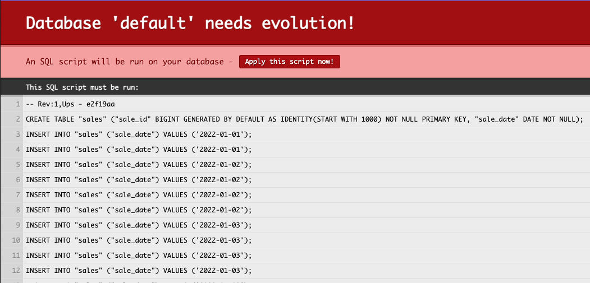
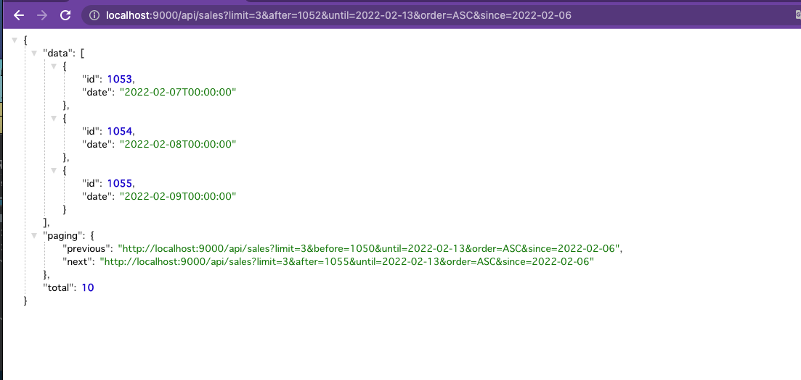

# play-scala-slick-partial-results

This project demonstrates how to page though results using a similar technique described in the [SQL Performance Explained](https://sql-performance-explained.com/) book.
This is a [Play](https://www.playframework.com/) project with
[Slick](https://scala-slick.org/)
[Play-Slick](https://www.playframework.com/documentation/latest/PlaySlick).
To run the project:

```bash
# Open the SBT shell
sbt 
# Start the play dev server
run
```

When you access http://localhost:9000/api/sales with your browser, 
it will prompt you to run the script. It will initialize the H2 mem database for you.


If you have a JSON Formatter installed in your browser, it will display JSON results that you can page through by clicking the paging cursor.


The range of the record defaults to the last one week of the records in the mem database.
There are 64 records in the mem database, dated between 2022-01-01 and 2022-02-14 that you can specify with `since` and `until` query parameters.

You can also access the mem database via `jdbc:h2:tcp://localhost:9092/mem:play` 
Try deleting existing records as you page through the results with the cursor.


